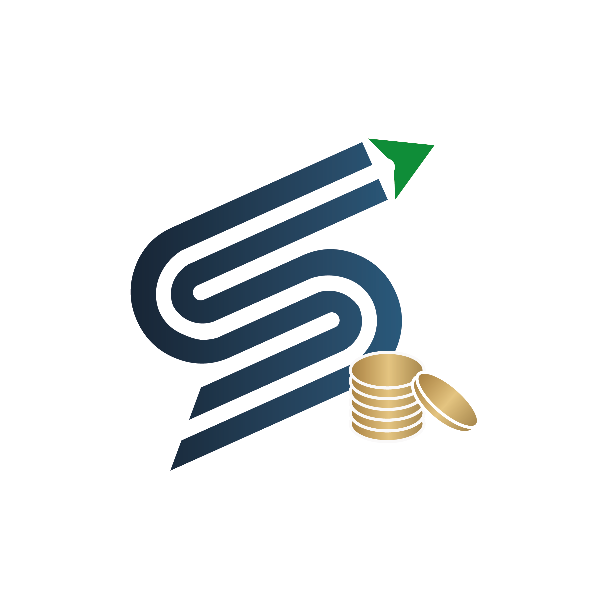
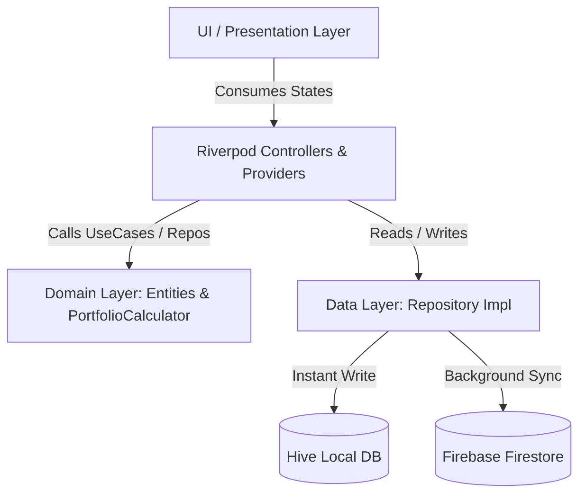

<p align="center">
  <a href="#">
    
  </a>
</p>

<h1 align="center">📈 Stock Book</h1>

<p align="center">
  <b>A Premium, Offline-First Stock Investment & Portfolio Tracking Mobile Application</b>
</p>

<p align="center">
  
  
  
  
  
  
</p>

<p align="center">
  <a href="#-key-features">Key Features</a> •
  <a href="#-tech-stack--libraries">Tech Stack</a> •
  <a href="#-architecture--data-flow">Architecture</a> •
  <a href="#-getting-started">Getting Started</a> •
  <a href="#-project-structure">Project Structure</a>
</p>

---

## 🌟 Overview

**Stock Book** is a state-of-the-art mobile application engineered for investors who demand real-time portfolio insights with **zero latency** and **uncompromising offline access**. Designed with Flutter and Riverpod following **Clean Architecture (DDD)**, Stock Book bridges local Hive storage with cloud-backed Firebase Firestore synchronization.

---

## ⚡ Key Features

| Feature | Description | Tech Highlight |
| :--- | :--- | :--- |
| **📊 Real-Time Dashboard** | Monitor Portfolio Value, Starting Capital, Currently Invested, Free Cash, and Realized P/L at a glance. | `fl_chart`, `riverpod` |
| **💼 Offline-First Engine** | Instant UI updates written to Hive local DB first, then synced to Firestore when online. | `hive_flutter`, `cloud_firestore` |
| **🎯 Target Selling Price** | Set target profit goals per lot and get live gain estimations (`+XX.X%`). | Domain Portfolio Calculator |
| **🎨 Premium Dark Theme** | Curated palette with `#0F172A` deep navy backgrounds, glassmorphism, and Outfit typography. | `google_fonts`, `flutter_animate` |
| **📱 Native Launcher Mask** | Adaptive Android launcher icon blending seamlessly into all launcher shapes. | `flutter_launcher_icons` |
| **🔐 Frictionless Auth** | Anonymous & Google authentication backed by Firebase Security Rules. | `firebase_auth`, `google_sign_in` |

---

## 🛠 Tech Stack & Libraries

### **Core Stack**
-  **Framework**: Cross-platform UI toolkit.
-  **Language**: Type-safe, high-performance runtime.

### **State & Architecture**
-  **State Management**: Reactive, compile-safe dependency injection.
- **Freezed & JSON Serializable**: Immutable models with pattern matching and serialization.

### **Storage & Cloud Backend**
-  **Local Database**: Ultra-fast key-value NoSQL database.
-  **Cloud Database**: Real-time Firestore sync & backup.

---

## 🏗 Architecture & Data Flow

Stock Book strictly adheres to **Domain-Driven Design (DDD)** and **Clean Architecture**, separating concerns into clear layers:



### **Data Flow Principles**
1. **User Action**: User creates/edits a stock lot.
2. **Immediate UI Update**: Data is updated in local Hive storage instantly (0ms latency).
3. **Background Sync**: If connected to internet, changes sync asynchronously to Firestore without blocking the UI.

---

## 🚀 Getting Started

### **Prerequisites**
Ensure you have the following installed on your developer machine:
- **Flutter SDK**: `>= 3.12.0`
- **Dart SDK**: `>= 3.0.0`
- **Android Studio** / **Xcode** (for iOS builds)

### **1. Clone the Repository**
```bash
git clone https://github.com/yourusername/stock_investment_tracker.git
cd stock_investment_tracker
```

### **2. Install Dependencies**
```bash
flutter pub get
```

### **3. Generate Code Artifacts**
Run `build_runner` to generate Riverpod providers, Freezed models, and Hive adapters:
```bash
dart run build_runner build --delete-conflicting-outputs
```

### **4. Launch the Application**
```bash
# Run on connected Android or iOS device / emulator
flutter run
```

---

## 📁 Project Structure

```text
stock_investment_tracker/
├── assets/
│   └── icon/                 # PNG & SVG Logo assets and app icons
├── lib/
│   ├── core/                 # App Colors, Constants, Theme & Utilities
│   ├── data/                 # Models, DTOs, Hive Adapters & Repositories
│   ├── domain/               # Core Entities, Calculators & Business Logic
│   │   ├── calculator/       # PortfolioCalculator & Summary logic
│   │   └── entities/         # Stock, Lot, Sale entities
│   ├── presentation/         # UI Screen & Widgets
│   │   ├── auth/             # Sign In & Authentication Screens
│   │   ├── dashboard/        # Main Portfolio Summary & Asset Allocation Cards
│   │   ├── splash/           # Animated Splash Screen
│   │   ├── transactions/     # Add Buy / Edit Lot Bottom Sheets & Cards
│   │   └── routing/          # GoRouter Navigation Setup
│   └── main.dart             # App Entry point & Initialization
├── pubspec.yaml              # App configuration & package dependencies
└── README.md                 # Project Documentation
```

---

## 🖼 App Branding & Splash

<p align="center">
  
</p>

The app features a custom-crafted high-resolution icon (`Stockk.png`) with an adaptive background (`#FFFFFF`) designed for modern Android 13+ thematic icons and iOS squircle standards.

---

## 🤝 Contributing

Contributions are what make the open-source community an amazing place to learn, inspire, and create.

1. Fork the Project
2. Create your Feature Branch (`git checkout -b feature/AmazingFeature`)
3. Commit your Changes (`git commit -m 'feat: Add AmazingFeature'`)
4. Push to the Branch (`git push origin feature/AmazingFeature`)
5. Open a Pull Request

---

## 📄 License

Distributed under the MIT License. See `LICENSE` for more details.

---

<p align="center">
  <b>Powered by Coding District</b>
</p>
