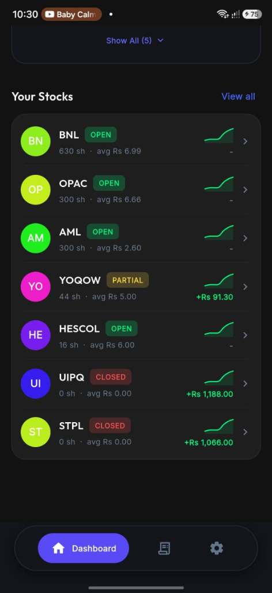
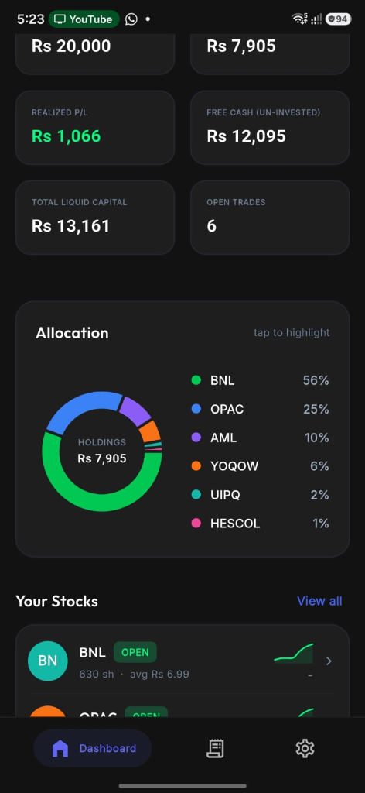
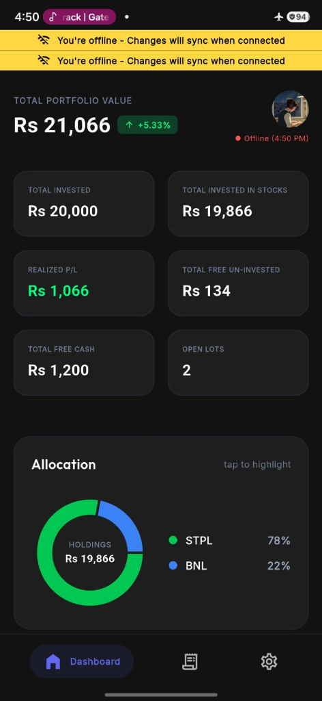
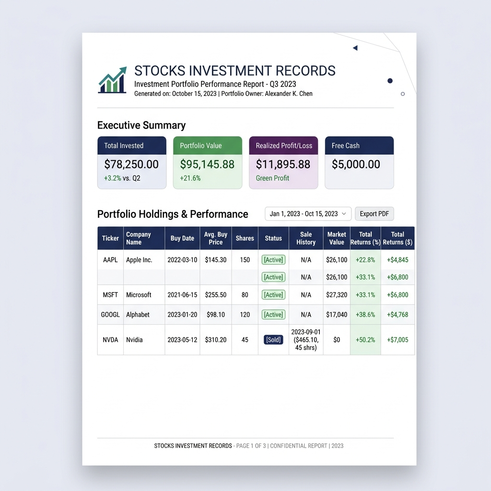
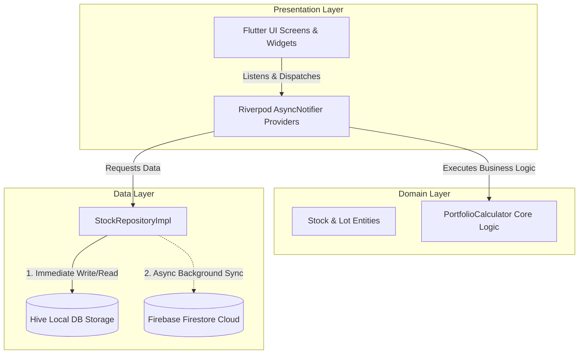

<div align="center">

  

  # 📈 Stock Book
  **The Next-Gen, Offline-First Stock Investment & Portfolio Tracking App**

  [](https://flutter.dev)
  [](https://dart.dev)
  [](https://firebase.google.com)
  [](https://riverpod.dev)
  [](https://pub.dev/packages/hive)
  [](LICENSE)

  ---

  <a href="#-app-showcase--screenshots">View Screenshots</a> •
  <a href="#-key-features">Key Features</a> •
  <a href="#-tech-stack">Tech Stack</a> •
  <a href="#-architecture--offline-sync">Architecture</a> •
  <a href="#-getting-started">Getting Started</a> •
  <a href="#-project-structure">Project Structure</a>

</div>

<br/>

---

## 📱 App Showcase & Screenshots

<div align="center">

| 📊 Portfolio Dashboard | 🎯 Target Selling Price & Lots | 📝 Add & Edit Buy Transactions | 📄 PDF Statement Export |
| :---: | :---: | :---: | :---: |
|  |  |  |  |

</div>

---

## ⚡ Key Features

### 💎 Core Capabilities

- 📊 **Real-Time Portfolio Overview**
  - Instant calculations for **Total Portfolio Value**, **Starting Capital**, **Currently Invested**, **Free Cash**, and **Realized Profit & Loss**.
  - Interactive asset allocation pie charts powered by `fl_chart`.

- ⚡ **Offline-First Synchronization**
  - Full CRUD operations work **100% offline**.
  - Local persistence via **Hive DB** ensures 0ms latency.
  - Background sync pushes queued transactions to **Firebase Firestore** seamlessly when connectivity returns.

- 🎯 **Target Selling Price & Profit Goal Estimator**
  - Specify a target selling price per share when purchasing or editing stock lots.
  - Displays real-time estimated percentage return (`+XX.X% Est. Gain`) on every lot card.

- 📄 **PDF Portfolio Report Generator**
  - Generate high-resolution PDF statements of your portfolio breakdown & transaction history directly from the app.

- 🎨 **State-of-the-Art Visual Aesthetics**
  - Deep Navy Blue theme (`#0F172A`) with emerald green (`#00E676`) and vibrant accents.
  - Google's **Outfit** typography and fluid micro-animations powered by `flutter_animate`.

---

## 🛠 Tech Stack & Badges

<div align="center">

### 💻 Technologies & Frameworks

| Category | Technology | Usage |
| :--- | :--- | :--- |
| **Framework** |  | Cross-Platform Mobile Application |
| **Language** |  | Type-Safe Client Logic |
| **State Management** |  | Reactive State & Dependency Injection |
| **Local Storage** |  | Lightweight NoSQL Local Database |
| **Cloud Backend** |  | Real-Time Cloud Storage & Sync |
| **Auth** |  | Anonymous & Cloud Authentication |
| **Navigation** |  | Declarative Routing System |
| **UI & Charts** |  | Interactive Portfolio Charts |

</div>

---

## 🏗 Architecture & Offline Sync

**Stock Book** follows **Domain-Driven Design (DDD)** and **Clean Architecture** principles. Business rules and domain models remain completely isolated from UI and external framework code.



### 🔁 Offline Sync Strategy

```text
[ User Inputs Transaction ] 
           │
           ▼
  ┌─────────────────┐
  │ Write to Hive   │ ⚡ (Instant UI Render - 0ms delay)
  └────────┬────────┘
           │
           ├─── (Internet Available?)
           │        ├── YES ──► Write directly to Firebase Firestore
           │        └── NO  ──► Queue in Hive Sync Stack
           ▼
[ Connection Restored ] ──► Process Queue ──► Sync to Firestore
```

---

## 🚀 Getting Started

### 📋 Prerequisites
- **Flutter SDK**: `>=3.12.0`
- **Dart SDK**: `>=3.0.0`
- **Android Studio** / **Xcode** for platform builds

### 📥 Step-by-Step Setup

1. **Clone the Repository**
   ```bash
   git clone https://github.com/yourusername/stock_investment_tracker.git
   cd stock_investment_tracker
   ```

2. **Fetch Dependencies**
   ```bash
   flutter pub get
   ```

3. **Generate Models & Providers**
   ```bash
   dart run build_runner build --delete-conflicting-outputs
   ```

4. **Run on Emulator / Device**
   ```bash
   flutter run -t lib/main_dev.dart --flavor dev
   ```

---

## 📁 Directory Hierarchy

```text
stock_investment_tracker/
├── 📁 assets/
│   ├── 📁 icon/                   # App logos (Stockk.png, SVG assets)
│   └── 📁 screenshots/            # App screenshots and PDF report mockups
├── 📁 lib/
│   ├── 📁 core/                   # Design Tokens, AppColors, Theme, Formatters
│   ├── 📁 data/                   # Data Models, DTOs, Hive Adapters, Repositories
│   ├── 📁 domain/                 # Business Domain
│   │   ├── 📁 calculator/         # PortfolioCalculator math engine
│   │   └── 📁 entities/           # Stock, Lot, Sale Domain Entities
│   ├── 📁 presentation/           # Presentation Layer
│   │   ├── 📁 auth/               # Sign In & Onboarding UI
│   │   ├── 📁 dashboard/          # Portfolio Dashboard & Card Widgets
│   │   ├── 📁 splash/             # Animated Splash Screen
│   │   ├── 📁 transactions/       # Add Buy & Edit Lot Bottom Sheets
│   │   └── 📁 routing/            # GoRouter Navigation Config
│   └── main.dart                  # Application Entrypoint
├── pubspec.yaml                   # Package Dependencies & Assets
└── README.md                      # Application Documentation
```

---

## 💡 Key Highlights & Code Quality

<details>
<summary><b>🔥 Click to expand: Domain Portfolio Calculator Implementation</b></summary>

```dart
// Pure Dart business logic without framework dependencies
class PortfolioCalculator {
  static PortfolioSummary calculateSummary(List<Lot> lots, {double startingCapital = 0.0}) {
    final currentlyInvested = lots
        .where((lot) => calculateLotStatus(lot) != LotStatus.closed)
        .fold(0.0, (sum, lot) => sum + calculateAmountInvestedRemaining(lot));

    final realizedPL = lots.fold(0.0, (sum, lot) => sum + calculateLotRealizedPL(lot));
    final portfolioValue = startingCapital > 0 ? (startingCapital + realizedPL) : (currentlyInvested + realizedPL);

    return PortfolioSummary(
      startingCapital: startingCapital,
      currentlyInvested: currentlyInvested,
      realizedPL: realizedPL,
      portfolioValue: portfolioValue,
    );
  }
}
```

</details>

---

## 🤝 Contributing

Contributions, issues, and feature requests are welcome!

1. **Fork** the Repository
2. Create your **Feature Branch** (`git checkout -b feature/CoolFeature`)
3. **Commit** your Changes (`git commit -m 'feat: Add CoolFeature'`)
4. **Push** to the Branch (`git push origin feature/CoolFeature`)
5. Open a **Pull Request**

---

<div align="center">

  <b>Designed & Built with ❤️ by Coding District</b>

</div>
