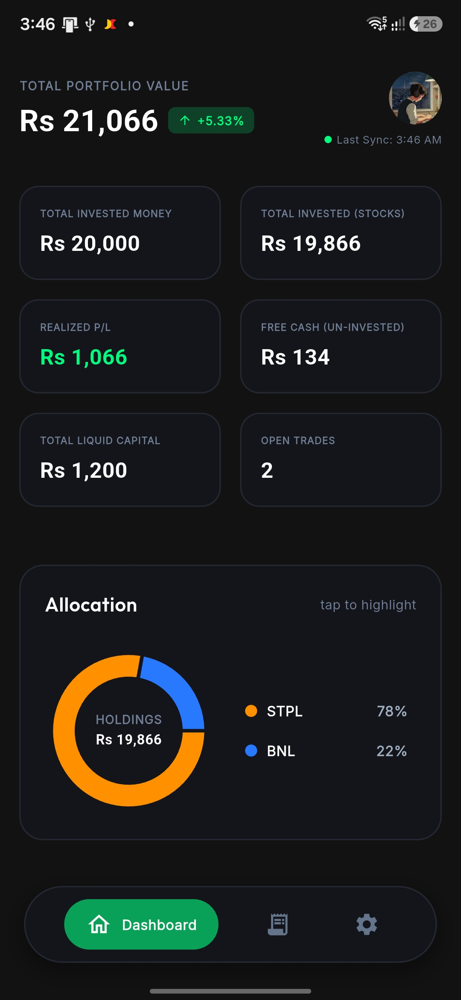
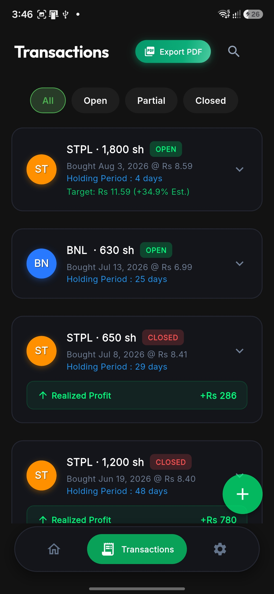
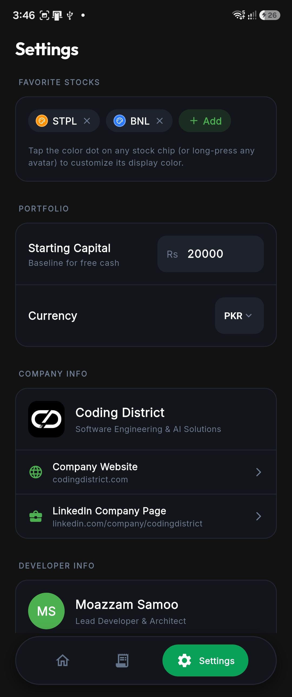
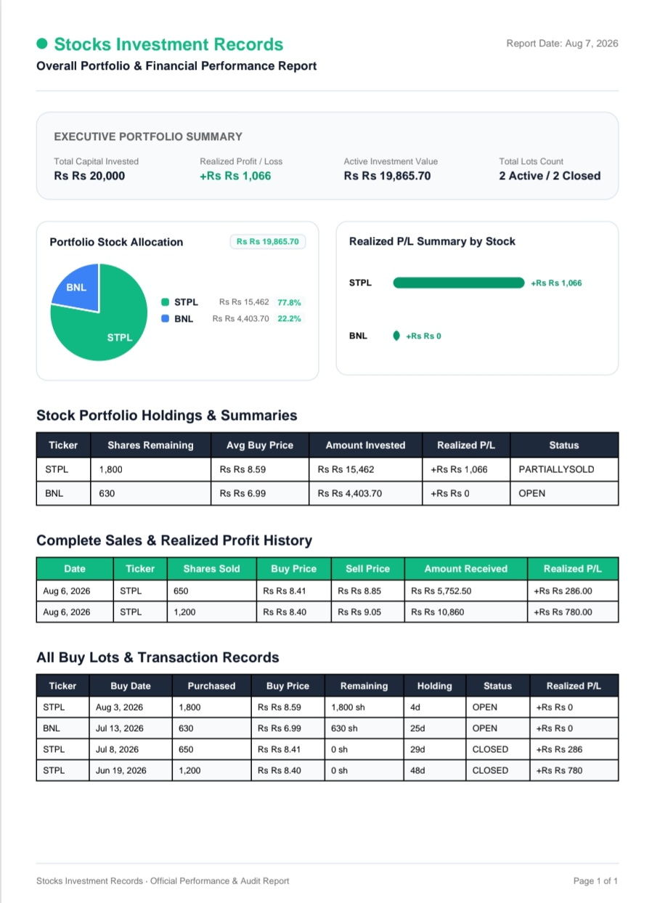
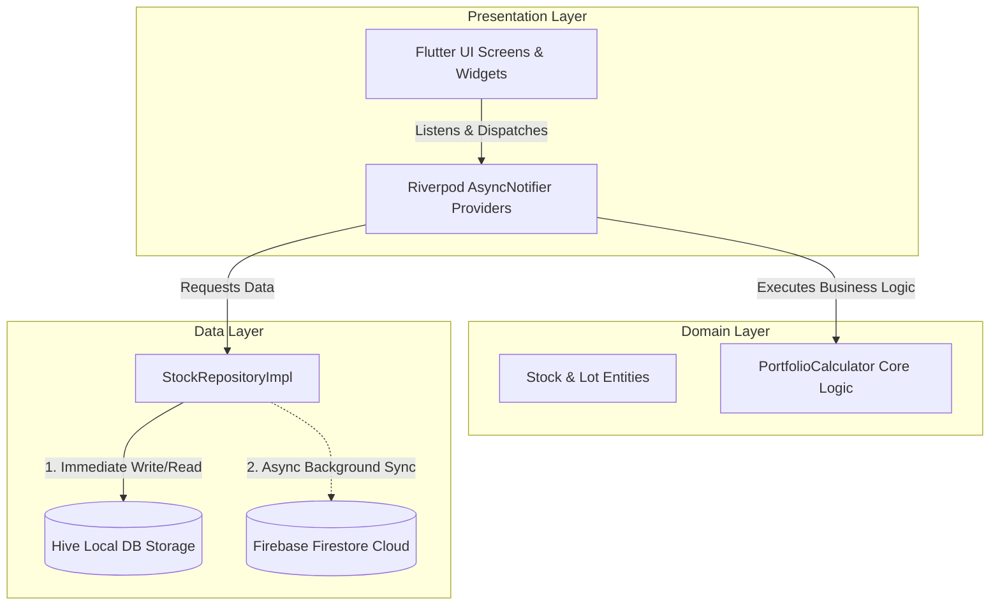

<div align="center">

  

  # Stock Book
  **The Next-Gen, Offline-First Stock Investment & Portfolio Tracking App**

  [](https://flutter.dev)
  [](https://dart.dev)
  [](https://firebase.google.com)
  [](https://riverpod.dev)
  [](https://pub.dev/packages/hive)
  [](LICENSE)

  ---

  <a href="#-app-showcase--screenshots">View Screenshots</a> •
  <a href="#-key-features">Key Features</a> •
  <a href="#-recent-updates">Recent Updates</a> •
  <a href="#-tech-stack">Tech Stack</a> •
  <a href="#-architecture--offline-sync">Architecture</a> •
  <a href="#-getting-started">Getting Started</a> •
  <a href="#-project-structure">Project Structure</a>

</div>

<br/>

---

## 📱 App Showcase & Screenshots

<div align="center">

| 📊 Portfolio Dashboard | 🎯 Transactions | 📝 Settings | 📄 PDF |
| :---: | :---: | :---: | :---: |
|  |  |  |  |

</div>

---

## ⚡ Key Features

### 💎 Core Capabilities

- 📊 **Real-Time Portfolio Overview**
  - Instant calculations for **Total Portfolio Value**, **Starting Capital**, **Currently Invested**, **Free Cash**, and **Realized Profit & Loss**.
  - Interactive asset allocation pie charts powered by `fl_chart`.

- ⚡ **Offline-First Synchronization**
  - Full CRUD operations work **100% offline**.
  - Local persistence via **Hive DB** ensures 0ms latency.
  - Background sync pushes queued transactions to **Firebase Firestore** seamlessly when connectivity returns.

- 🎯 **Target Selling Price & Profit Goal Estimator**
  - Specify a target selling price per share when purchasing or editing stock lots.
  - Displays real-time estimated percentage return (`+XX.X% Est. Gain`) on every lot card.

- 📄 **PDF Portfolio Report Generator**
  - Generate high-resolution PDF statements of your portfolio breakdown & transaction history directly from the app.

- 🎨 **State-of-the-Art Visual Aesthetics**
  - Deep Navy Blue theme (`#0F172A`) with emerald green (`#00E676`) and vibrant accents.
  - Google's **Outfit** typography and fluid micro-animations powered by `flutter_animate`.

---

## 🆕 Recent Updates

Everything below shipped on the `feat/positions-and-alerts` branch: the app went from a simple
offline lot-tracker with **no live market data** to a full **position-based portfolio tracker with
real PSX prices, trailing price alerts, and end-to-end push notifications** — backed by a Python
scraper running on a schedule in GitHub Actions. Grouped by theme below, not strict commit order.

### 🧮 Position-Based Portfolio Engine (replaces the old Lot model)

- New domain model — `Position`, `PositionBuy`, `PositionSale` — replacing the original flat `Lot`
  model, with a from-scratch `PositionCalculator` (moving-average cost, realized/unrealized P/L,
  multi-cycle holding history) proven against a dedicated migration-safety test suite before any
  real data was touched.
- A one-time, idempotent **migration engine** rebuilds every user's `Position` history from their
  existing `Lot`/`Sale` records, validates the totals match exactly, and flags any corrupt input
  (e.g. a sale exceeding its lot's shares) instead of silently miscalculating.
- Closed holding cycles now render as **one card per buy** (`splitByBuy`) instead of one merged,
  confusing card; a ticker with both an open and a closed cycle correctly produces one summary row,
  not two.
- PDF report generation, the dashboard, and Transactions/Stock Detail screens were all migrated
  onto the new model.

### 🎨 Complete Light Theme (now the default)

- Full light-theme pass across every screen, a Settings toggle (Light / Dark / System), and
  dedicated golden + contrast tests so a future change can't silently regress readability again.
- **New installs now default to Light** — every fallback that used to read `'dark'` (the settings
  provider, the repository's offline/no-data fallbacks, the persisted-model default, and the
  loading-state fallback in `main.dart`) was switched to `'light'`.

### 💹 Live PSX Market Prices

- A Python backend (`scripts/price_alerts/`) runs on a GitHub Actions cron (every 5 minutes,
  market hours, Mon–Fri) and on-demand, scraping real PSX prices via `psxdata` and writing
  `market_prices/{ticker}` and `market_status/current` to Firestore.
- **Price freshness & market-open/closed badge**: Transactions and Stock Detail both show a
  pulsing green "Live" indicator while the market is confidently open, or a red "at Closed" suffix
  next to the last known price when it isn't — replacing an old, less useful "fetched N minutes
  ago" marker.
- **On-demand refresh**: pulling to refresh on Transactions triggers the actual GitHub Action
  (owner-only, via a fine-grained personal access token stored in encrypted device storage —
  never hardcoded, since the repo is public and an APK is trivially decompilable), and adding a
  new holding auto-triggers a price fetch for it immediately.
- Fixed three separate bugs that were silently hiding live prices for some or all tickers:
  a `market_prices` schema mismatch between the backend and the app's model, a ticker-normalization
  gap (a stray trailing space made `"BNL "` and `"BNL"` two different documents), and the backend
  skipping any position whose `status` string didn't exactly match an allow-list instead of mirroring
  the app's own "not literally closed" rule.
- Discovered and fixed a real PSX data-source gap: its `screener()` endpoint — the backend's main
  price source — silently omits roughly 120 real, actively-traded equities (confirmed live: 1016
  listed symbols vs. 745 in `screener()`). Added a per-ticker historical-price fallback for exactly
  those tickers.

### 🔔 Price & Buy-Target Alerts — trailing, not one-shot

- Push notification infrastructure (FCM + `flutter_local_notifications`) delivering real alerts in
  **every** app state — foreground, backgrounded, and fully terminated — including a background
  isolate handler and cold-start tap-routing, which didn't exist before and meant real alerts were
  previously invisible whenever the app wasn't in the foreground.
- **Sell-target alerts** (set per position) and **Buy-target alerts** (a dedicated Alerts tab, its
  own FAB, tolerance-percent threshold) redesigned from one-shot to **trailing/repeating**: a sell
  alert keeps notifying on each further ~1% climb past the target instead of going silent the
  moment you're in profit, and a buy alert keeps notifying on each further ~1% drop.
- Notification text now shows the **target price you actually set**, not the live price that
  happened to trigger it, with the ticker in the title itself (e.g. "BNL hits your Buy target").
- Fixed a real account-switching bug: a stale "how was this app process originally launched"
  check was replaying the very first cold-start notification's route onto every newly logged-in
  account, even a brand-new empty one — now gated to fire at most once per real app launch.
- The Target line's bell icon now always shows once a target is set (dim outline = armed and
  watching, solid green = has already fired), instead of only appearing after the first fire,
  which used to read as "no alert is set" for a target simply not reached yet.

### 🔍 Searchable Ticker Picker

- Add Buy, Add Alert, and Favorites all now share one autocomplete widget that searches by
  **symbol or company name** against the full PSX-listed reference set, instead of requiring the
  user to already know the exact ticker symbol.
- Fixed a critical bug where the repository read the wrong Firestore field name, silently breaking
  company-name search entirely while the matching test's own fixture happened to use the same
  wrong key (so it passed anyway).

### 🖥 UI/UX Polish

- Stock Detail header redesigned: avatar + ticker + the full company name as a subtitle, the
  status tag aligned beside it, and price/open-closed-state/unrealized P/L grouped into one
  bordered card instead of several loosely-styled lines.
- Settings' Company Info / Developer Info merged under one "About Us" heading as two compact
  cards — bigger profile photo, Website/LinkedIn links reduced to small icon buttons instead of
  full-width list rows.
- Fixed a real Android IME bug where typing into the ticker-search field, or the Buy/Sell shares
  and price fields, silently blocked the backspace key (an anchored regex text formatter that
  conflicts with the IME's composing region) — several rounds of this were found across different
  bottom sheets and fixed consistently.

### 🧪 Test Coverage

- **247 Dart tests** (widget, unit, golden, and contrast tests) and **40 Python backend tests**,
  both fully green, plus `flutter analyze` at 0 errors, verified before every commit on this branch.

---

## 🛠 Tech Stack & Badges

<div align="center">

### 💻 Technologies & Frameworks

| Category | Technology | Usage |
| :--- | :--- | :--- |
| **Framework** |  | Cross-Platform Mobile Application |
| **Language** |  | Type-Safe Client Logic |
| **State Management** |  | Reactive State & Dependency Injection |
| **Local Storage** |  | Lightweight NoSQL Local Database |
| **Cloud Backend** |  | Real-Time Cloud Storage & Sync |
| **Auth** |  | Anonymous & Cloud Authentication |
| **Navigation** |  | Declarative Routing System |
| **UI & Charts** |  | Interactive Portfolio Charts |

</div>

---

## 🏗 Architecture & Offline Sync

**Stock Book** follows **Domain-Driven Design (DDD)** and **Clean Architecture** principles. Business rules and domain models remain completely isolated from UI and external framework code.



### 🔁 Offline Sync Strategy

```text
[ User Inputs Transaction ] 
           │
           ▼
  ┌─────────────────┐
  │ Write to Hive   │ ⚡ (Instant UI Render - 0ms delay)
  └────────┬────────┘
           │
           ├─── (Internet Available?)
           │        ├── YES ──► Write directly to Firebase Firestore
           │        └── NO  ──► Queue in Hive Sync Stack
           ▼
[ Connection Restored ] ──► Process Queue ──► Sync to Firestore
```

---

## 🚀 Getting Started

### 📋 Prerequisites
- **Flutter SDK**: `>=3.12.0`
- **Dart SDK**: `>=3.0.0`
- **Android Studio** / **Xcode** for platform builds

### 📥 Step-by-Step Setup

1. **Clone the Repository**
   ```bash
   git clone https://github.com/yourusername/stock_investment_tracker.git
   cd stock_investment_tracker
   ```

2. **Fetch Dependencies**
   ```bash
   flutter pub get
   ```

3. **Generate Models & Providers**
   ```bash
   dart run build_runner build --delete-conflicting-outputs
   ```

4. **Run on Emulator / Device**
   ```bash
   flutter run -t lib/main_dev.dart --flavor dev
   ```

---

## 📁 Directory Hierarchy

```text
stock_investment_tracker/
├── 📁 assets/
│   ├── 📁 icon/                   # App logos (Stockk.png, SVG assets)
│   └── 📁 screenshots/            # App screenshots and PDF report mockups
├── 📁 lib/
│   ├── 📁 core/                   # Design Tokens, AppColors, Theme, Formatters
│   ├── 📁 data/                   # Data Models, DTOs, Hive Adapters, Repositories
│   ├── 📁 domain/                 # Business Domain
│   │   ├── 📁 calculator/         # PortfolioCalculator math engine
│   │   └── 📁 entities/           # Stock, Lot, Sale Domain Entities
│   ├── 📁 presentation/           # Presentation Layer
│   │   ├── 📁 auth/               # Sign In & Onboarding UI
│   │   ├── 📁 dashboard/          # Portfolio Dashboard & Card Widgets
│   │   ├── 📁 splash/             # Animated Splash Screen
│   │   ├── 📁 transactions/       # Add Buy & Edit Lot Bottom Sheets
│   │   └── 📁 routing/            # GoRouter Navigation Config
│   └── main.dart                  # Application Entrypoint
├── pubspec.yaml                   # Package Dependencies & Assets
└── README.md                      # Application Documentation
```

---

## 💡 Key Highlights & Code Quality

<details>
<summary><b>🔥 Click to expand: Domain Portfolio Calculator Implementation</b></summary>

```dart
// Pure Dart business logic without framework dependencies
class PortfolioCalculator {
  static PortfolioSummary calculateSummary(List<Lot> lots, {double startingCapital = 0.0}) {
    final currentlyInvested = lots
        .where((lot) => calculateLotStatus(lot) != LotStatus.closed)
        .fold(0.0, (sum, lot) => sum + calculateAmountInvestedRemaining(lot));

    final realizedPL = lots.fold(0.0, (sum, lot) => sum + calculateLotRealizedPL(lot));
    final portfolioValue = startingCapital > 0 ? (startingCapital + realizedPL) : (currentlyInvested + realizedPL);

    return PortfolioSummary(
      startingCapital: startingCapital,
      currentlyInvested: currentlyInvested,
      realizedPL: realizedPL,
      portfolioValue: portfolioValue,
    );
  }
}
```

</details>

---

## 🤝 Contributing

Contributions, issues, and feature requests are welcome!

1. **Fork** the Repository
2. Create your **Feature Branch** (`git checkout -b feature/CoolFeature`)
3. **Commit** your Changes (`git commit -m 'feat: Add CoolFeature'`)
4. **Push** to the Branch (`git push origin feature/CoolFeature`)
5. Open a **Pull Request**

---

<div align="center">

  <b>Designed & Built with ❤️ by Coding District</b>

</div>
